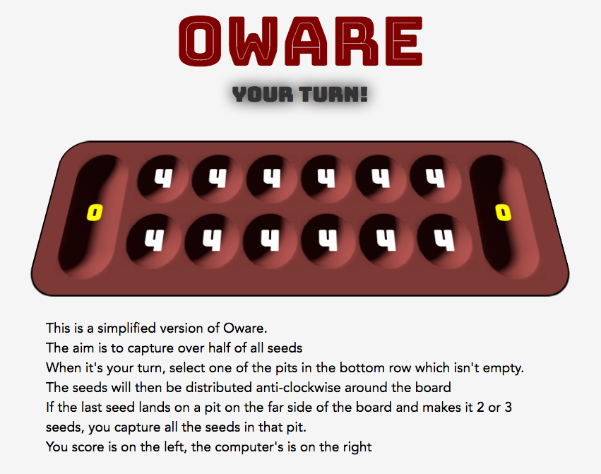

Oware
=====

This is a simplified version of the Oware board game implemented in Javascript.

Can be run either client-side from index.html, or using an node/express single-page app on localhost:3000/

Rules are shown on-screen.

This is a work in progress, e.g. currently doesn't allow capture from more than one pit or handle end-of-game conditions.
